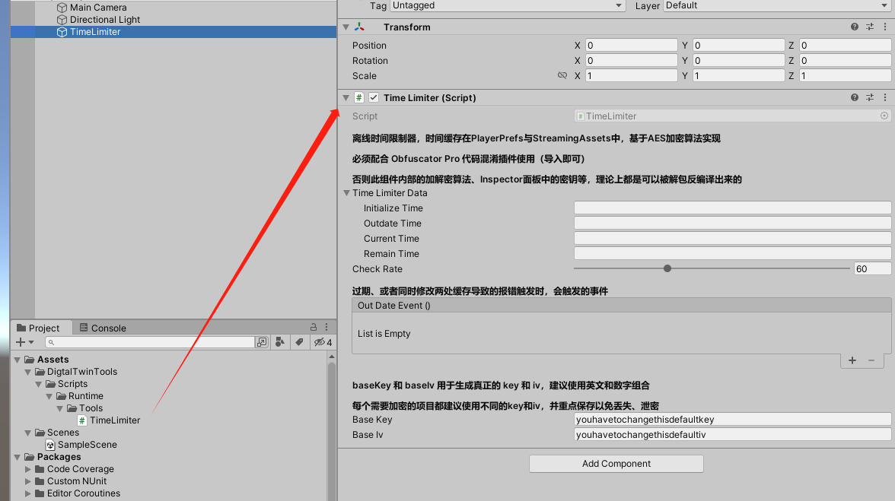
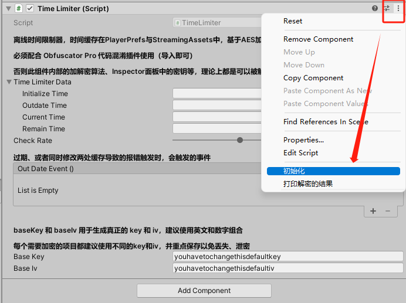
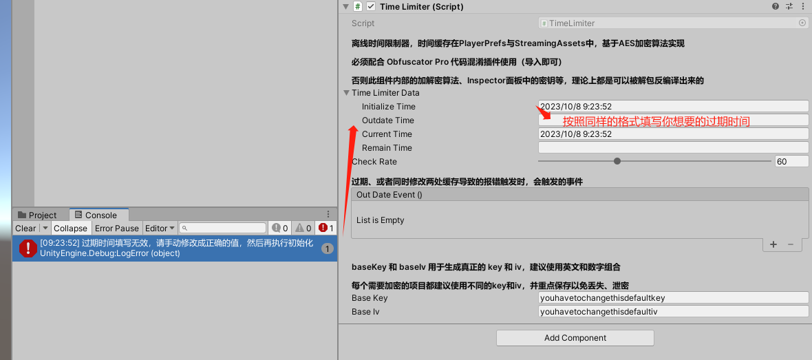
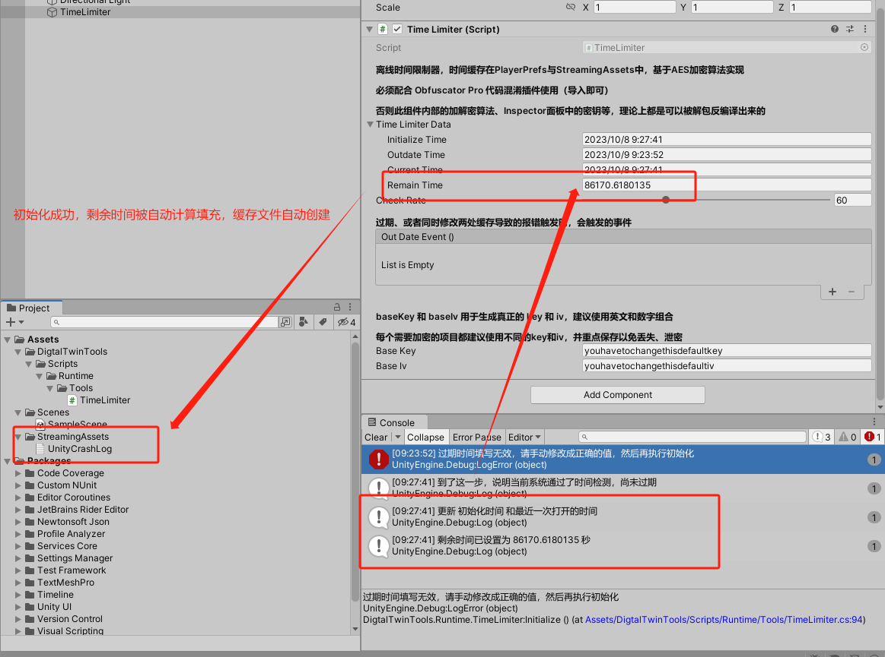
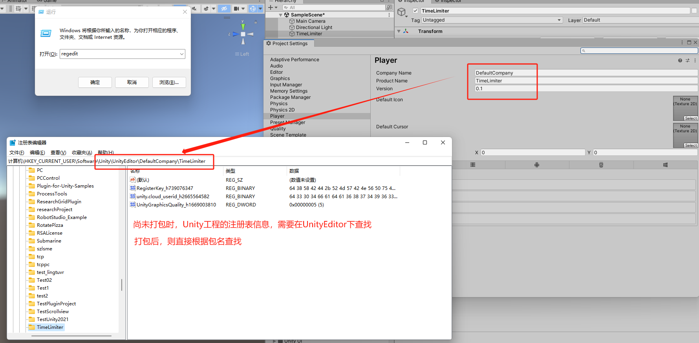
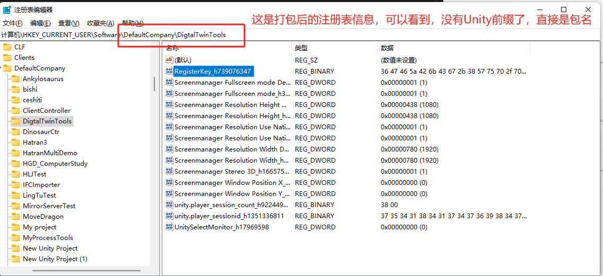
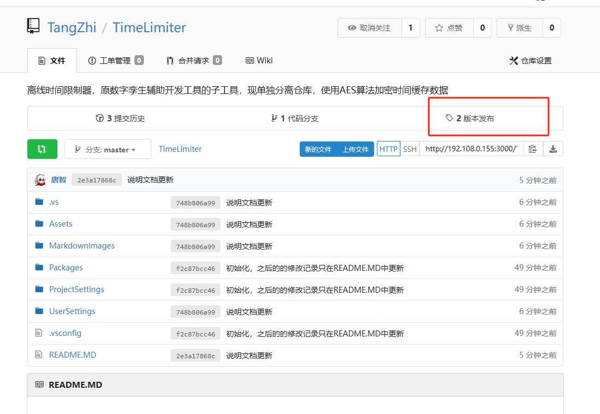
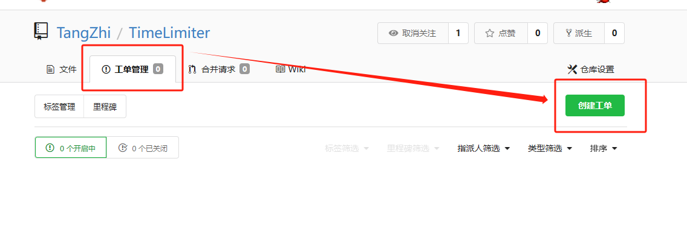

# 离线时间限制器

## 使用说明

点击收起/展开

 

 1. 导入package后给场景任意物体绑定TimeLimiter组件，如图所示

  

 2. 右键组件右上角，点击初始化，如图所示

  

 3. 此时Console面板会提示：“过期时间填写无效，请手动修改成正确的值，然后再执行初始化”，之后，可根据TimeLimiterData中的InitializeTime的时间格式，填写OutdateTime（过期时间）如图所示

  

 4. 完成填写后，再次点击初始化，此时若出现下图提示，且remainTime（剩余时间）被自动填充，则说明成功

  

 5. CheckRate（检查过期频率）的单位是秒，用于决定每隔多少秒执行一次检查过期的判定（Start时会检查一次），如无必要，不需要修改

 
     后续剩余时间的更新方法：由于Streaming Assets中的时间缓存文件的优先级是最高的，
     所以只要重新在Unity中修改好新的时间，并初始化一次，再把Streaming Assets的文件提供给客户替换，即可达到更新时间设置的效果

 注1： 过期事件的绑定、密钥的设定，在上图中Inspector面板上说明的很清楚了，这里不再赘述

 注2： PlayerPrefs（PC端为注册表）内容的查看，如下图所示：

  
     其中的 RegisterKey 就是时间缓存数据，可自行检验删除注册表，测试功能是否正常等

  

  

-----

## 依赖资源下载

点击收起/展开

 

 1. 点击仓库上方的版本发布，可下载所有关联资源及TimeLimiter组件UnityPackage，如下图所示 

  

 1. Newtonsoft.Json.dll：用于Json解析，根据现有环境选择性下载 

 1. Obfuscator Pro（代码混淆插件）：理论上Unity代码、场景信息都是可以被解包反编译查看的 

-----

## 问题反馈

点击收起/展开

 

 使用时如果发现问题或漏洞，点击仓库页面中的工单管理，创建工单提交

  

 
-----

## 更新日志
### 2023/10/07

点击收起/展开

 

 1. 分离主工具打包，仓库初始化

 2. 更正部分注释内容

 3. Markdown内容编写

 4. 调整一处代码判定，解决C#6.0以前版本无法兼容的问题

 5. 修正多种未考虑周全的情况下，时间缓存未正常保存的问题

-----